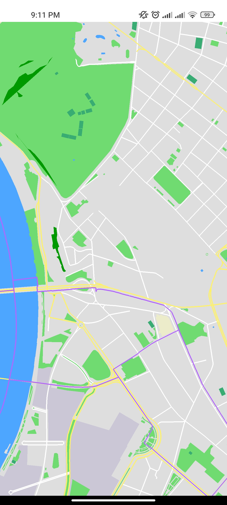
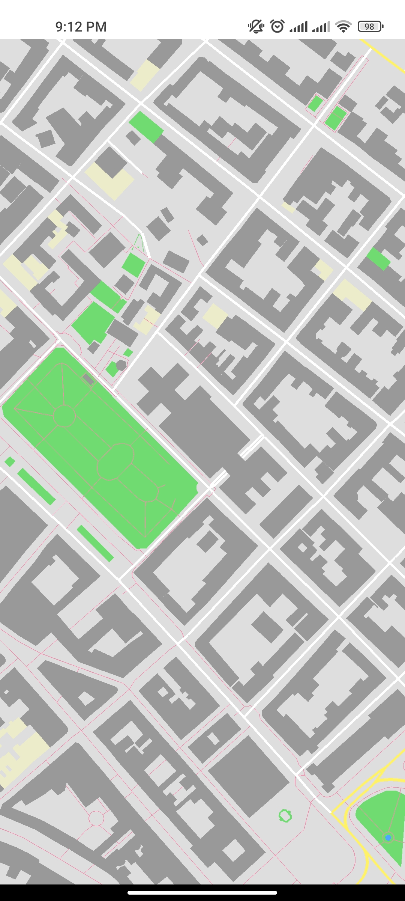

# OSMRenderer
OSMRenderer is Android application for offline rendering OpenStreetMap data. 
It uses OpenGL ES for rendering and sqlite with rtree module for storing data. 

This repo has stored Belgrade data for rendering. 
To render different area you need to download data from Overpass API https://www.openstreetmap.org/export. 
Then run osm2sqlite.py script on that data with command python osm2sqlite.py map SQLITE_DB. 
Script should take several seconds to run, for Belgrade data it took me about 30s. 
And then replace SQLITE_DB file in OSMRenderer/app/src/main/assets/database/ folder with newly created file.

 
